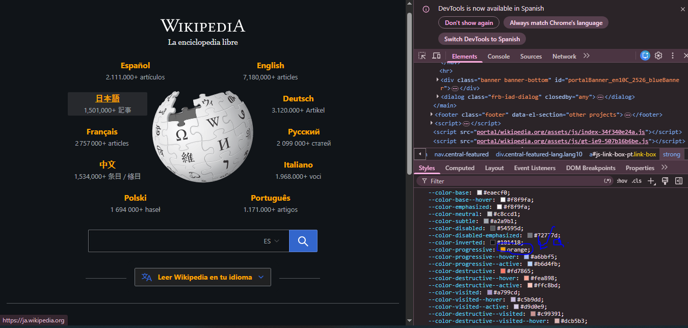
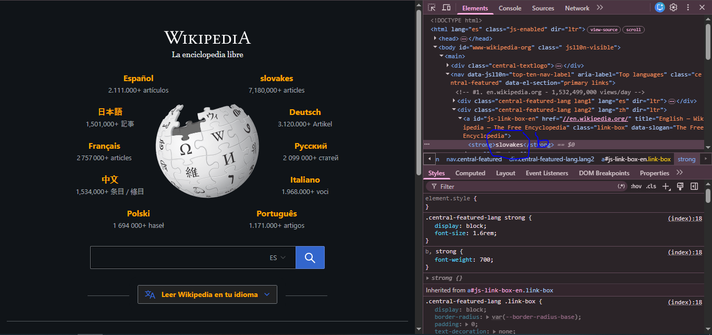
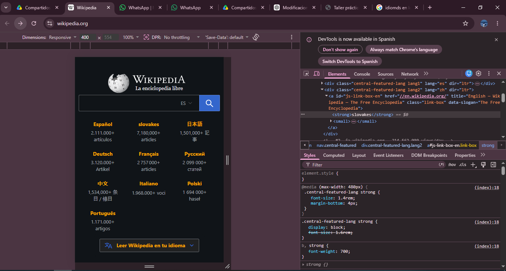
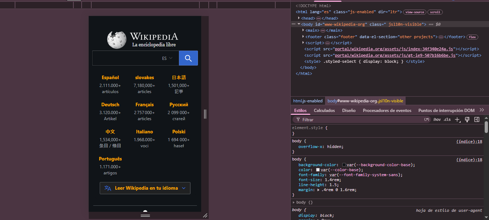
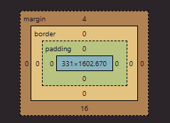
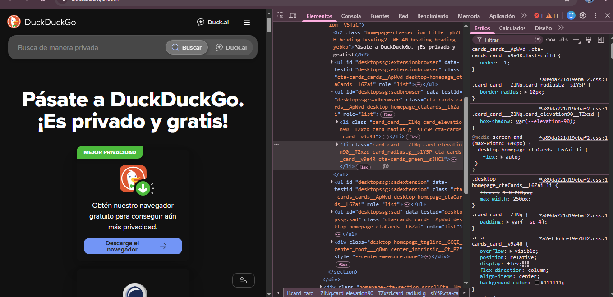

punto 6

Punto A

Punto B

C. ¿Cómo están compuestos estos módulos de idioma?

Los módulos de idioma están formados principalmente por:

Un elemento <a> (enlace principal).
Un <strong> para el nombre del idioma.
Un <small> para mostrar la cantidad de artículos.
Clases CSS que controlan tamaño, posición y estilo.

D. ¿Cómo están colocados?

Los idiomas están organizados alrededor del logo central usando:

CSS Position
Flexbox y posicionamiento absoluto
Coordenadas específicas para distribuirlos alrededor de la esfera.

Cada idioma tiene una clase con propiedades como:

position: absolute;
top: ...
left: ...

Esto permite colocarlos en forma circular alrededor del logo de Wikipedia.

E.

Cambios observados:

Los idiomas se acomodan más juntos.
El buscador se reduce.
Los elementos mantienen diseño centrado.
El contenido ocupa menos ancho.

F.

Cambios observados:
Los idiomas aparecen más compactos.
Algunos elementos reducen tamaño.
La barra de búsqueda ocupa casi todo el ancho.
El diseño se adapta verticalmente.

G.

La caja de búsqueda tiene aproximadamente:

Ancho (width): 331 px

Alto: 44 px aproximadamente

Además, el modelo de caja muestra:

padding: 0

border: 0

margin-top: 4 px

margin-bottom: 16 px

i. ¿Cuánta separación tiene con el botón de buscar?
La separación horizontal entre la caja de búsqueda y el botón es prácticamente:

0 px

Es decir, están pegados.

ii. ¿Qué hay de raro con esa separación?
Lo curioso es que:

Aunque parecen dos elementos diferentes, visualmente se ven como un solo bloque.

Wikipedia elimina casi todo el espacio entre ambos elementos.

Los bordes se unen para dar apariencia de una sola barra de búsqueda continua.

Esto mejora el diseño visual y hace que el buscador se vea más limpio y moderno.

Punto 7

